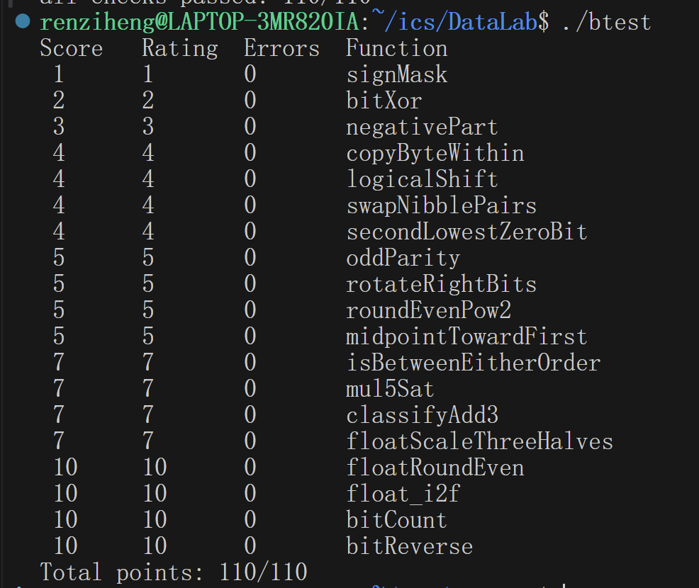
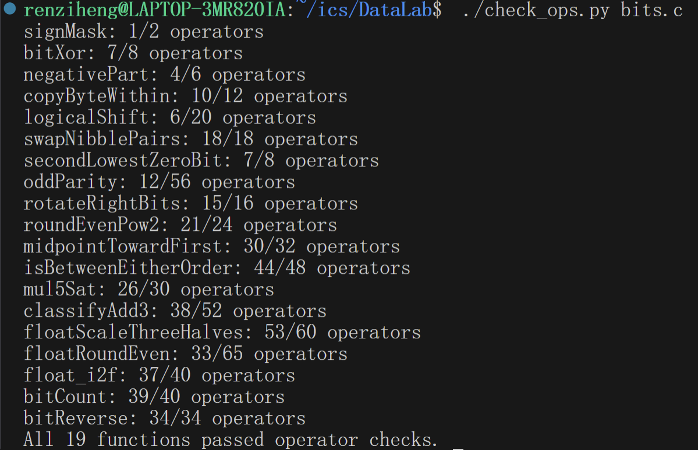

# DataLab 实验报告

25803060007 任子衡

以下逐题介绍思路。

## Q1 signMask

要求生成的数值只有最高位为1，其余位均为0，故将1左移31位即可。

## Q2 bitXor

只有`p`和`q`均为0或均为1时结果为1，为了表示这一点可以使用两个表达式：`x & y`和`~x & ~y`，他们分别在同时取1和同时取0时取到1。

将它们结合起来，注意要让这两种情况下取到0，则可以分别取反再取并，即`~(~x & ~y) & ~(x & y)`，经检验发现其确实符合条件。

## Q3 negativePart

若`x`是负数，需将补码`x`还原为`(~x + 1)`；若`x`是正数，输出0。

因此使用掩码`x>>31`，与`(~x + 1)`取与。由于是算数右移，当x为负时，掩码全部为1，对运算结果无影响，输出`(~x + 1)`；当x为正时，掩码全部为0，取与后强行将结果调整为0。

## Q4 copyByteWithin

首先提取第`src`个字节。首先将`x`右移`src << 3`个比特，用掩码`0xFF`提取最后8位数字，存入`y`；并将其移动到第`dst`个字节处，即将`y`左移`dst << 3`个字节，存入`z`。

然后将`x`的第`dst`个字节的内容清零，通过`0xFF << (dst << 3)`生成一个掩码，第`dst`个字节为1，其余为0；取反后，第`dst`个字节为0，其余为1，再与`x`取与，就能达到目的，存入`w`。

最后取`w | z`，从而将提取出的第`src`个字节填入目标位置，不影响其他位置数值。

## Q5 logicalShift

要构造逻辑位移，必须以算术位移`x >> n`为基础，在此基础上构造掩码以消除所有前`n`位上的1。掩码需满足前`n`位均为0，其他都为1。

掩码构造如下：首先通过`1 << 31`构造首位为1，其余位为0；然后算术右移`n`次，此时前`n+1`位为1，其余位为0；最后左移一位并取反即可。

将掩码与`x >> n`与运算，即可消除多余的1，完成逻辑位移。

## Q6 swapNibblePairs

设计两个掩码，`low`用来提取每个字节的后四位，`high`用来提取每个字节的前四位，分别要求每个字节的后四位为1、前四位为0和后四位为0、前四位为1，即`0x0F0F0F0F`和`0xF0F0F0F0`。用1~255的正整数可以分别表示为`0x0F|(0x0F<<8)|(0x0F<<16)|(0x0F<<24)`和`0xF0|(0xF0<<8)|(0xF0<<16)|(0xF0<<24)`。

将`x`与`low`与运算后左移四位，即将后四位移到前四位；将`x`与`high`与运算后右移四位，并用`low`作为掩码清除算术右移补入的1，即将前四位移到后四位。二者或运算即可得到最终结果。

## Q7 secondLowestZeroBit

要找倒数第二个零的掩码`second`，先找倒数第一个零的掩码`first`，并把这一位通过运算`x | first`修改为1，再找一次倒数第一个零的掩码，与第一次算法完全相同。

要找倒数第一个零，先用运算`x+1`将从最低位开始的所有连续的1变成0，并将最低的0变成1，其余位不变；`~x`将所有1变成0，所有0变成1；两者相与，只有最低的0处二者同时为1，故可以生成倒数第一个零的掩码。

进行或运算后重复此过程，即可得到倒数第二个零的掩码。

## Q8 oddParity

为了判断1的数量的奇偶，我们可以使用异或运算依次比较所有位，将数值相同的位“两两相消”，最后若剩下1，说明有奇数个1，反之说明有偶数个。

为了减少算符使用，我们采取并行折叠的方法，先将相邻的1位比较，再分别比较2、4、8、16位，这样可以同时比较大量数据，每次完成一半，并将比较结果向最低位汇聚。实现方法是将`x`与`x>>n`进行异或运算。

此时得到的`x`在最低位上存储了所有的比较结果，但在其他位上还存有折叠过程中的中间产物，所以通过`x & 1`运算来取出最后一位；最后再与1进行异或操作，因为题目要求在奇数个1时生成0而非1。

## Q9 rotateRightBits

要将后`n`位移到最前方，就要先提取后`n`位`low`和前面的`high`。要提取低`n`位，需要一个低`n`位为1、其余位为0的掩码，可以通过将1左移`n`位再减1得到，减1操作用`+ ~0`替换。

要提取其余的位，需要一个低`32-n`位为1、其余位为0的掩码，将`x >> n`与其与运算，以去除算术右移可能补入的1。

最后将`low`左移`32-n`位，并和`high`进行或运算，就将`low`和`high`的位置互换。

## Q10 roundEvenPow2

如果不考虑“入”，则可以通过末`n`位的掩码`mask`（最后`n`位为1，其余为0）来实现，与取反后的掩码`~mask`与运算即可，这时得到的数值`q`即为直接砍掉余数时的结果。同时余数`r`可以写作`x & mask`。

同时还要加上可能的进位：先求出$2^{n}$的一半`half`等于`1 << (n + ~0)`。若`r`小于`half`，则进位`roundup`取0；若`r`大于`half`，则进位`roundup`取1；若`r`等于`half`，则如果`q`的第`n`位为1即为奇数则`roundup`取1，反之取0。最后结果就是`q + roundup << n`。

为此，先定义变量`r_is_half`，如果`r`等于`half`则为1，反之则为0；再定义`x_n`表示`q`的第`n`位。为了比较`r`和`half`的大小，我们发现当`r`小于`half`时，`r + half`小于$2^{n}$，$2^{n}$位数值为0，反之为1。故可以用表达式``((r + half) >> n) & 1``来表示这一关系，当它为1时说明`r`大于等于`half`，考虑进位。此时还要考虑，如果`r_is_half`为0，则进位；若为1，再看`x_n`的数值，若为1，则需要进位，这一关系可以通过`r_is_half`和`x_n`的或运算解决。

最后将两个判断用与运算合并即可得到`roundup`数值，也就达到了目的。

## Q11 midpointTowardFirst

首先要计算`x`和`y`的中点`mid`，但不能直接相加，因为有溢出风险。解决方法是利用表达式`(x & y) + ((x ^ y) >> 1)`，因为`x + y = 2*(x & y) + (x ^ y)`。此时的`mid`是向下取整的平均值，如果需要向上取就加1。

当`x + y`是奇数且`x > y`时，需向上取整。判断`x + y`奇偶性，只需要比较`x`和`y`末位是否相同，即`odd = (x ^ y) & 1`，为1说明是奇数。

接着判断`x > y`，但不能直接相减，因为有溢出风险。同号时，不会溢出，直接求差`diff`，并用`sameGt`标记此时的大小关系，通过`diff`的符号判断；异号时，直接用`diffGt`标记大小关系，对比`x`和`y`的符号即可。用`samesign`标记二者是否同号，并利用它构造掩码区分两种情况，得到可能的进位值`gt`。

最后`mid + (odd & gt)`即为最终结果。

## Q12 isBetweenEitherOrder

命题等价于计算`(x >= a & x<= b) | (x >= b & x <= a)`。只要做出一个大于等于运算，复制黏贴并代入上述公式即可。

以`ge_xa`即`x >= a`为例。Q11中作了大于的判断，这里采用相同的逻辑，但代码写的更为紧凑，且不需要`!!d_xa`一项，因为等于在这里也可以。同理进行四次判断即可。

## Q13 mul5Sat

首先计算`x * 5`的数值`res`，通过`(x << 2) + x`表示；其次要判断乘积是否会溢出。

若要不溢出，`x`的绝对值必须小于等于`0x7FFFFFFF`的五分之一即`0x19999999`，此数存储在`lim`中。要完成判断必须构造绝对值函数，先通过`x >> 31`表示`x`的符号（0为正，-1为负），再通过`(x + sign) ^ sign`即可构造绝对值`x_abs`（容易验证）。

再设计掩码`mask`表示乘法有无溢出，也即`x_abs`与`lim`的大小关系，也即判断`lim - x_abs`的正负性，完成作差后右移31位，得到0说明`x_abs`小于`lim`，不会溢出；反之得到-1说明会溢出。

最后为了选择符号正确的饱和值`sat`，设计`((~sign) & ~(1 << 31)) | (sign & (1 << 31))`。最后将几个判断合并起来考虑，输出即可。

## Q14 classifyAdd3

分类讨论：如果`t = x + y`不溢出，那么只需要判断`u = t + z`是否溢出即可；如果`x + y`正溢出（此时`t`是一个负数），那么如果`t + z`没有负溢出，说明`z`还不够小，没法把溢出的数值拉回来，输出1；否则返回0。同理，如果`x + y`负溢出（此时`t`是一个正数），那么如果`t + z`没有正溢出，说明`z`还不够大，没法把溢出的数值拉回来，输出1；否则返回0。

最终使用分类讨论，用`ret1`表示应返回1，`retm1`表示应返回-1。将它们组合起来即可，方法与Q13中相似。

## Q15 floatScaleThreeHalves

首先用位运算取出`s` `exp` `frac`三部分，并在NaN或无穷大时返回原值。Q16中相应地也进行了这些操作。

为方便乘除，专门把输入写成`m * 2^e`的形式。对于正规数，`value = (1.frac) * 2^(exp-127)`，把`1.frac`看成整数`m = (1 << 23) | frac`，则`e = exp - 150`。对于次正规数，`m = frac，e = -149`。这样就统一了不同浮点数的形式。

`e`减去1即可表示除以2，`m`乘以3即可给原数乘以3。为了防止`m3`超出原有的位数范围，需要分类讨论。

若`m3`大于等于2^23，则需要将其规格化为`1.xxxx * 2^?`的形式。此时需要舍入，如果丢弃位是1，且保留部分最低位是1，就进位。对于只丢1位的情况，只有当保留部分为奇数时才进位，使其变偶数；对于丢2位的情况，若丢掉的两位是3，则进位；是2，则规格化后的`m_norm`是奇数则进位；小于2，舍去。如果`m_norm`从`0xFFFFFF`进位成`0x1000000`，就超过24位了。此时右移1位，`shift`加1，指数相应增加。最后计算新的阶码并组装。

若`m3`小于2^23，计算`m3 / 2`，按照四舍六入五成双规则舍入，若进位则返回最小正规数，否则返回次正规数。

最后，将符号位原样拼接回去，就能得到正确结果。

## Q16 floatRoundEven

首先进行的操作与Q15类似，意在排除特殊情况。先将结果统一成`M * 2^(exp-150)`，要取整，就是把这个数右移`r = 150 - exp`位，若`r > 24`，则这个数绝对值小于1，四舍五入到整数必然为0。

除此之外的情况，取整数部分`q = M >> r`，余数`rem = M & ((1<<r)-1)`，半数`half = 1 << (r-1)`。若`rem > half`，进位；`rem < half`，不进位；`half = rem`，调整到偶数。若舍入后整数部分为0，还需要保留符号。

最后，把整数`q`重新编码成浮点数。先找`q`的最高有效位位置`msb`，也就是`floor(log2(q))`，用二分法逐段缩小，并计算新阶码和尾数，组装起来就是答案。
## Q17 float_i2f

先处理0的情况，直接输出0。然后取出符号位`sign`和绝对值`mag`。然后使用二分法找`mag`的最高位下标`p`，原理和Q16中相同，并相应地计算阶码。

当`p <= 23`时，`mag`的有效位数不超过24位（包括隐含的1），可以精确放入23位尾数中。而尾数大于23时则需要舍入，需要右移多出位数后进行四舍六入五成双。为减少op数量，这里先给`mag`加上一个偏置`bias`，再右移。把`mag`写成`q * 2^shift + rem`后，`rem`是丢弃部分、`half = 2^(shift-1)`是一半、`lsb = q & 1`是保留部分最低位，加完`bias`再右移是否进位，就等价于判断`rem + lsb >= half + 1`：当`rem > half`时必然成立而进位，当`rem < half`时必然不成立而舍去，当`rem = half`时是否进位完全取决于`lsb`，即保留部分为奇数才进位、为偶数则保持，从而自动完成“恰好一半时向偶数舍入”，以避免像Q16一样进行分支判断。

之后处理舍入进位，避免舍入后发生进位使位数达到24；最后将答案组合起来即可。

## Q18 bitCount

为了减少op数量，可以采用折叠的计数方式，让相邻的位相加，逐步合并统计结果。首先让相邻的2位（共16组）两两相加，这样每两位就存储了这两位中原本1的数量；再让相邻的4位（共8组）中前两位和后两位相加，这样每四位就存储了这四位中原本1的数量；以此类推，最后前16位和后16位相加，这样得到的结果就是1的总数。

要完成这种错位相加，可以借助前面swapNibblePairs的思路，通过相应的掩码和移位完成。例如第一次移位，需要掩码满足0、1交错，故使用`mask_1 = 0x55555555`，用`(x & mask_1) + ((x>>1) & mask_1)`完成操作。同理，后面使用的掩码分别为`0x33333333`、`0x0F0F0F0F`、`0x00FF00FF`、`0x0000FFFF`。

## Q19 bitReverse

为了减少op数量，采用折叠交换的方式，先让相邻的两位两两交换，再让相邻的四位前两位与后两位交换，以此类推，直到最后前16位与后16位交换。每一步的实现方法都和swapNibblePairs类似（事实上swapNibblePairs就是这里的第3步），前四步总共需要8个掩码，最后一步则只需要1个即可。

为了将op数量压到极致，同一步使用的两个掩码可利用~符号构造，因为它们完全互补。

## 实验结果一览

如下所示，代码通过了所有测试：

## 参考资料
Q8的并行折叠算法参考了https://zhuanlan.zhihu.com/p/601704743。Q18和Q19也参考了这一思路。

题目中许多基础的部件（例如大于小于的判断、判断溢出、分类讨论等）的实现向ai工具征询了意见。如果同一个部件采取了不同的实现，多半就是这个原因。

